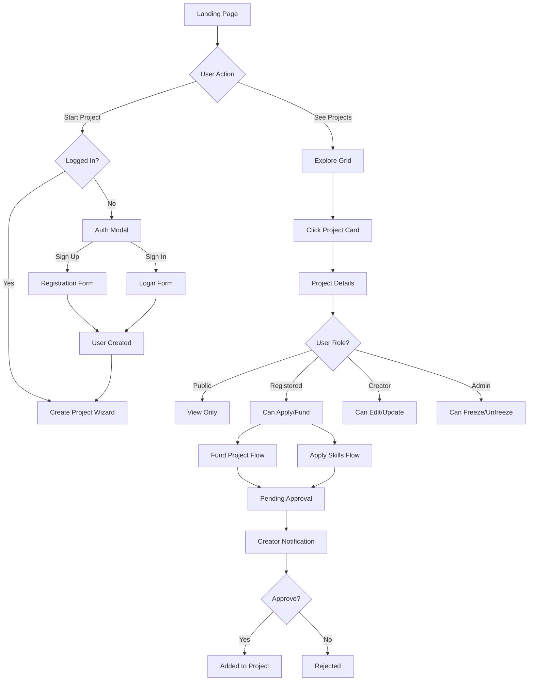
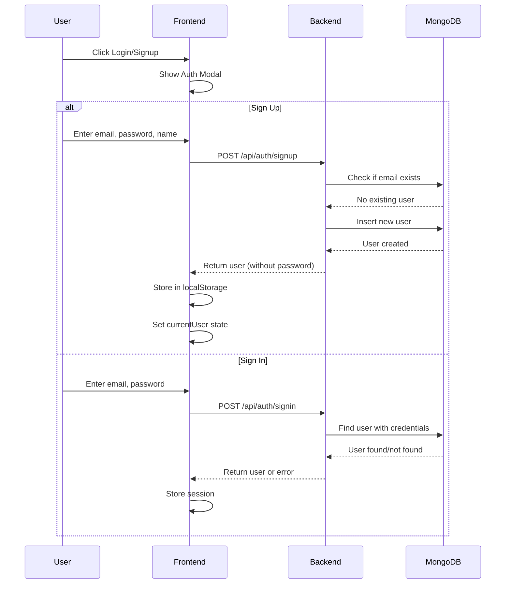
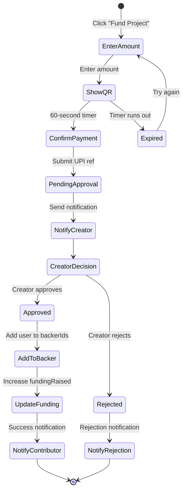
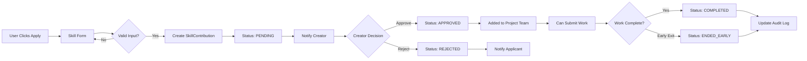
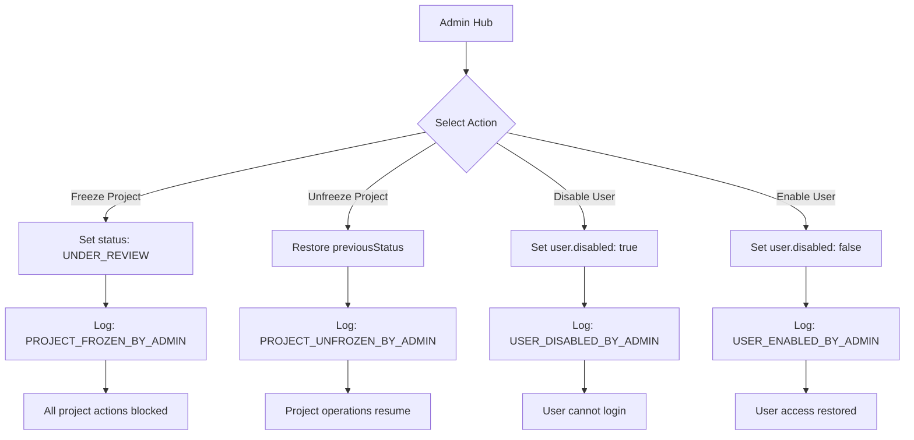

# CrowdFundX - Complete Technical Documentation

## Table of Contents
1. [Executive Summary](#executive-summary)
2. [Technology Stack & Justification](#technology-stack--justification)
3. [Project File Structure](#project-file-structure)
4. [Database Architecture](#database-architecture)
5. [Data Models & Schema](#data-models--schema)
6. [Application Flow Diagrams](#application-flow-diagrams)
7. [User Interaction Flowcharts](#user-interaction-flowcharts)
8. [Page Descriptions](#page-descriptions)
9. [API Reference](#api-reference)
10. [Component Documentation](#component-documentation)
11. [Service Layer](#service-layer)
12. [Security Considerations](#security-considerations)

---

## Executive Summary

**CrowdFundX** is an institutional-grade crowdfunding platform built on trust and transparency. Unlike traditional crowdfunding platforms that focus on marketing hype, CrowdFundX emphasizes:

- **Process over Promise**: Tracking milestones, updates, and deliverables
- **Verifiable Skills**: Contributors prove their expertise before joining projects
- **Permanent Audit Trail**: Every action is logged for accountability
- **Reputation System**: Building long-term trust through consistent execution

---

## Technology Stack & Justification

### Frontend Technologies

```
┌─────────────────────────────────────────────────────────────────┐
│                      FRONTEND STACK                              │
├──────────────┬──────────────────────────────────────────────────┤
│ React 19     │ Latest React with concurrent features            │
│ TypeScript   │ Type safety and better developer experience      │
│ Vite         │ Fast build tool with HMR (Hot Module Reload)     │
│ Tailwind CSS │ Utility-first CSS for rapid UI development       │
│ Lucide React │ Modern, consistent icon library                  │
└──────────────┴──────────────────────────────────────────────────┘
```

#### Why React 19?
- **Component-Based Architecture**: Perfect for building complex UIs with reusable components
- **Virtual DOM**: Efficient rendering for real-time updates (notifications, funding progress)
- **Concurrent Features**: Better handling of multiple simultaneous user actions
- **Large Ecosystem**: Extensive library support for future features
- **Industry Standard**: Easy to find developers and resources

#### Why TypeScript?
- **Type Safety**: Catches errors at compile-time, especially important for complex data models (Projects, Users, Milestones)
- **Better IDE Support**: IntelliSense, autocomplete, and refactoring tools
- **Self-Documenting Code**: Types serve as inline documentation
- **Easier Maintenance**: Safer refactoring as the codebase grows

#### Why Vite?
- **Fast Development**: Near-instant hot module replacement
- **Optimized Builds**: Efficient production bundles using Rollup
- **Native ES Modules**: Modern JavaScript module system
- **Simple Configuration**: Less boilerplate than Webpack

#### Why Tailwind CSS?
- **Rapid Prototyping**: Style directly in JSX without context switching
- **Consistent Design**: Built-in design system with spacing, colors, typography
- **Small Bundle Size**: Only includes used styles in production
- **Responsive Design**: Easy mobile-first approach with breakpoint prefixes

#### Why Lucide React?
- **Consistent Icons**: Unified design language across the application
- **Tree-Shakeable**: Only imports used icons
- **TypeScript Support**: Full type definitions
- **Active Maintenance**: Regular updates and new icons

### Backend Technologies

```
┌─────────────────────────────────────────────────────────────────┐
│                      BACKEND STACK                               │
├──────────────┬──────────────────────────────────────────────────┤
│ Node.js      │ JavaScript runtime for server-side code          │
│ Express.js   │ Minimal, flexible web framework                  │
│ MongoDB      │ Document-based NoSQL database                    │
│ MongoDB Atlas│ Cloud-hosted database service                    │
└──────────────┴──────────────────────────────────────────────────┘
```

#### Why Node.js + Express?
- **JavaScript Everywhere**: Same language on frontend and backend
- **Non-Blocking I/O**: Handles many concurrent connections efficiently
- **Lightweight**: Minimal overhead for API endpoints
- **npm Ecosystem**: Access to thousands of packages

#### Why MongoDB?
- **Flexible Schema**: Perfect for evolving data structures (projects can have varying fields)
- **Document Model**: Naturally maps to JavaScript objects
- **Nested Data**: Supports embedded documents (milestones, updates within projects)
- **Horizontal Scaling**: Easy to scale for growing user base

#### Why MongoDB Atlas?
- **Managed Service**: No server maintenance required
- **Built-in Replication**: Automatic data redundancy
- **Global Distribution**: Low latency access worldwide
- **Easy Backups**: Automated point-in-time recovery

---

## Project File Structure

```
crowdfundx/
├── Root Configuration Files
│   ├── package.json          # Dependencies and scripts
│   ├── tsconfig.json         # TypeScript configuration
│   ├── vite.config.ts        # Vite build configuration
│   ├── tailwind.config.js    # Tailwind CSS configuration (if present)
│   ├── index.html            # HTML entry point
│   ├── netlify.toml          # Netlify deployment config
│   ├── render.yaml           # Render deployment config
│   └── replit.md             # Project documentation for Replit
│
├── Core Application Files
│   ├── index.tsx             # React app entry point
│   ├── App.tsx               # Main application component
│   ├── types.ts              # TypeScript type definitions
│   └── constants.tsx         # Application constants
│
├── pages/                    # Main page components
│   ├── LandingPage.tsx       # Homepage with hero and features
│   ├── AuthFlow.tsx          # Login/signup authentication
│   ├── CreateProject.tsx     # Multi-step project creation wizard
│   ├── ProjectDetails.tsx    # Detailed project view with tabs
│   ├── UserProfile.tsx       # User profile management
│   ├── ReputationRegistry.tsx# Reputation leaderboard
│   ├── Archive.tsx           # Completed/failed projects archive
│   └── AdminHub.tsx          # Admin control panel
│
├── components/               # Reusable UI components
│   └── ProjectCard.tsx       # Project display card
│
├── services/                 # Service layer
│   ├── dbService.ts          # Frontend API client
│   ├── mongodb.ts            # MongoDB connection handler
│   └── geminiService.ts      # AI integration (if used)
│
└── server.ts                 # Express.js backend server
```

### File-by-File Description

#### Root Configuration Files

| File | Purpose | Key Contents |
|------|---------|--------------|
| `package.json` | Project metadata and dependencies | Scripts: `dev`, `build`, `server` |
| `tsconfig.json` | TypeScript compiler options | Strict mode, ES modules, React JSX |
| `vite.config.ts` | Build tool configuration | Port 5000, API proxy to 3001, allowedHosts |
| `index.html` | HTML template | Root div, Tailwind CDN, meta tags |

#### Core Application Files

| File | Purpose | Exports |
|------|---------|---------|
| `index.tsx` | Bootstrap React app | Renders `<App />` to DOM |
| `App.tsx` | Main app orchestrator | Navigation, state, routing logic |
| `types.ts` | Data structure definitions | Interfaces, enums, types |
| `constants.tsx` | Static data | Initial projects, categories |

---

## Database Architecture

### MongoDB Collections Schema

```
┌─────────────────────────────────────────────────────────────────┐
│                    DATABASE: crowdfundx                          │
├─────────────────────────────────────────────────────────────────┤
│                                                                  │
│   ┌─────────────────┐         ┌─────────────────────────┐       │
│   │    USERS        │         │       PROJECTS          │       │
│   ├─────────────────┤         ├─────────────────────────┤       │
│   │ _id (ObjectId)  │         │ _id (ObjectId)          │       │
│   │ id (string)     │         │ id (string)             │       │
│   │ email (unique)  │◄───────►│ creatorId               │       │
│   │ password        │         │ creatorName             │       │
│   │ name            │         │ title                   │       │
│   │ role[]          │         │ category                │       │
│   │ verificationSts │         │ status                  │       │
│   │ reputation      │         │ fundingGoal             │       │
│   │ avatar          │         │ fundingRaised           │       │
│   │ bio             │         │ milestones[]            │       │
│   │ notifications[] │         │ updates[]               │       │
│   │ socialLinks[]   │         │ skillContributors[]     │       │
│   │ ...             │         │ auditHistory[]          │       │
│   └─────────────────┘         │ pendingAnchors[]        │       │
│                               │ incentives[]            │       │
│                               │ ...                     │       │
│                               └─────────────────────────┘       │
│                                                                  │
└─────────────────────────────────────────────────────────────────┘
```

### Collection Relationships

```
┌──────────────────────────────────────────────────────────────────┐
│                     ENTITY RELATIONSHIPS                          │
├──────────────────────────────────────────────────────────────────┤
│                                                                   │
│   USER                         PROJECT                            │
│   ┌────────┐                  ┌──────────────┐                   │
│   │  1     │ creates          │     *        │                   │
│   │  User  │─────────────────►│  Projects    │                   │
│   │        │                  │              │                   │
│   └────────┘                  └──────────────┘                   │
│       │                              │                            │
│       │ backs                        │ contains                   │
│       │                              ▼                            │
│       │                       ┌──────────────┐                   │
│       └──────────────────────►│ Milestones   │                   │
│                               │ Updates      │                   │
│                               │ SkillContrib │                   │
│                               │ AuditLogs    │                   │
│                               │ Incentives   │                   │
│                               └──────────────┘                   │
│                                                                   │
└──────────────────────────────────────────────────────────────────┘
```

---

## Data Models & Schema

### Enumerations (types.ts)

```typescript
// User role categories
enum UserRole {
  CREATOR         // Can create and manage projects
  CONTRIBUTOR     // Can fund projects (capital contributor)
  SKILL_CONTRIBUTOR  // Can contribute skills to projects
  ADMIN           // Platform administrator
}

// User verification levels
enum VerificationStatus {
  ANONYMOUS       // Not logged in
  REGISTERED      // Account created
  EMAIL_VERIFIED  // Email confirmed
  ROLE_VERIFIED   // Professional role verified
  RESTRICTED      // Account limited
}

// Project lifecycle states
enum ProjectStatus {
  REVIEW          // Initial review phase
  ACTIVE          // Currently accepting funding/contributions
  STALLED         // No recent updates
  FAILED          // Did not reach goals
  COMPLETED       // Successfully finished
  UNDER_REVIEW    // Admin frozen for investigation
}

// Project categories
enum ProjectType {
  CREATIVE           // Art, music, film
  TECH_PRODUCT       // Software, hardware
  RESEARCH_ACADEMIC  // Scientific research
  SOCIAL_IMPACT      // Community projects
  LEARNING_EXPERIMENT // Educational experiments
}
```

### User Model

```typescript
interface User {
  id: string;                    // Unique identifier (u-timestamp)
  name: string;                  // Display name
  email: string;                 // Unique email (login)
  role: UserRole[];              // Array of roles
  verificationStatus: VerificationStatus;
  reputation: number;            // 0-100 trust score
  avatar: string;                // Dicebear avatar URL
  bio?: string;                  // Optional biography
  currentRole?: string;          // Current job title
  workDescription?: string;      // What they do
  portfolio?: string;            // Portfolio URL
  upiId?: string;                // Payment ID
  socialLinks: SocialLink[];     // External links
  institutionalProof?: string;   // Verification document
  pastProjectsCount?: {          // Track record
    completed: number;
    failed: number;
  };
  updateConsistency?: number;    // 0-100 consistency score
  notifications?: Notification[];
  disabled?: boolean;            // Admin disabled
}
```

### Project Model (Complete)

```typescript
interface Project {
  // === IDENTITY ===
  id: string;                    // Unique ID (proj-category-###)
  creatorId: string;             // User ID of creator
  creatorName: string;           // Creator display name
  title: string;                 // Project title
  oneLineSummary: string;        // Elevator pitch
  category: string;              // Technology, Arts, etc.
  projectType: ProjectType;      // CREATIVE, TECH_PRODUCT, etc.
  
  // === PROBLEM & SOLUTION ===
  problem: string;               // Problem being solved
  solution: string;              // Proposed solution
  
  // === TECHNICAL DETAILS ===
  stack?: string;                // Tech stack / methodology
  methodology?: string;          // Approach
  equipment?: string;            // Required equipment
  
  // === FINANCIAL STRUCTURE ===
  fundingGoal: number;           // Target amount
  fundingRaised: number;         // Current amount
  financialBreakdown: FinancialNode[];  // Budget items
  backerIds: string[];           // User IDs who funded
  pendingAnchors: PendingAnchor[];  // Pending contributions
  upiId?: string;                // Payment ID
  upiDisplayName?: string;       // Payment display name
  
  // === EXTERNAL RESOURCES ===
  projectLinks: ExternalLink[];  // Links and images
  contactEmail?: string;         // Contact email
  duration?: string;             // Expected duration
  
  // === SKILLS ===
  skillsNeeded: string[];        // Required skills
  skillContributors: SkillContribution[];  // Approved contributors
  
  // === STATUS & METRICS ===
  status: ProjectStatus;         // Current status
  reputationScore: number;       // Project trust score
  lastUpdate: string;            // ISO timestamp
  updateFrequency: UpdateFrequency;  // DAILY, WEEKLY, etc.
  
  // === EMBEDDED DOCUMENTS ===
  milestones: Milestone[];       // Project phases
  updates: ProjectUpdate[];      // Progress updates
  qa: ProjectQA[];               // Questions & answers
  auditHistory: AuditLog[];      // All actions logged
  incentives: ParticipationIncentive[];  // Rewards
  hasIncentives: boolean;        // Flag for incentives
  previousStatus?: ProjectStatus;  // For unfreeze
}
```

### Embedded Document Models

```typescript
// === MILESTONE ===
interface Milestone {
  id: string;
  title: string;                 // "Phase 1: Research"
  description: string;           // Detailed description
  goal: string;                  // What success looks like
  deliverable: string;           // Concrete output
  timeWindow: string;            // "4 weeks"
  status: 'PENDING' | 'ACTIVE' | 'COMPLETED' | 'FAILED';
  fundRelease?: number;          // Amount released at completion
  evidenceLink?: string;         // Proof of completion
}

// === PROJECT UPDATE ===
interface ProjectUpdate {
  id: string;
  timestamp: string;             // When posted
  milestoneId: string;           // Related milestone
  summary: string;               // Brief overview
  done: string;                  // What was accomplished
  changed: string;               // What changed from plan
  blocked: string;               // Current blockers
  evidence: string[];            // Proof links
}

// === SKILL CONTRIBUTION ===
interface SkillContribution {
  id: string;
  userId: string;                // Contributor's user ID
  userName: string;              // Display name
  skillCategory: string;         // "Development", "Design"
  specificSkill: string;         // "React", "UI/UX"
  level: 'Beginner' | 'Intermediate' | 'Advanced';
  contributionType: 'One-time' | 'Ongoing' | 'Advisory';
  commitment: string;            // "10h/week"
  duration: string;              // "3 months"
  tasks: string;                 // What they'll do
  output: string;                // Expected deliverables
  proof?: string;                // Portfolio link
  isLearning: boolean;           // Learning while contributing
  availability: 'Low' | 'Medium' | 'High';
  preferredCommunication: string;
  status: SkillStatus;           // PENDING, APPROVED, etc.
  timestamp: string;
  completionNote?: string;       // Final notes
}

// === FINANCIAL NODE ===
interface FinancialNode {
  id: string;
  item: string;                  // "Server Hosting"
  amount: number;                // 5000
  description: string;           // Details
  status: 'ESTIMATED' | 'ALLOCATED' | 'SPENT';
}

// === AUDIT LOG ===
interface AuditLog {
  id: string;
  action: AuditAction;           // What happened
  timestamp: string;             // When
  userId: string;                // Who did it
  details: string;               // Human-readable description
}

// All possible audit actions
type AuditAction = 
  | 'PROJECT_START'
  | 'MILESTONE_COMPLETE'
  | 'UPDATE_POSTED'
  | 'SKILL_APPROVED'
  | 'SKILL_COMPLETED'
  | 'SKILL_ENDED_EARLY'
  | 'PROJECT_CLOSED'
  | 'REPUTATION_ADJUST'
  | 'INCENTIVE_ADD'
  | 'CAPITAL_ANCHOR_PENDING'
  | 'CAPITAL_ANCHOR_APPROVED'
  | 'CAPITAL_ANCHOR_REJECTED'
  | 'ARCHITECT_REVISION'
  | 'PROJECT_FROZEN_BY_ADMIN'
  | 'PROJECT_UNFROZEN_BY_ADMIN'
  | 'USER_DISABLED_BY_ADMIN'
  | 'USER_ENABLED_BY_ADMIN';
```

---

## Application Flow Diagrams

### System Architecture Overview

```
┌──────────────────────────────────────────────────────────────────────────┐
│                         SYSTEM ARCHITECTURE                               │
├──────────────────────────────────────────────────────────────────────────┤
│                                                                           │
│    ┌─────────────┐        ┌─────────────┐        ┌─────────────┐         │
│    │   BROWSER   │        │   VITE DEV  │        │   EXPRESS   │         │
│    │   CLIENT    │◄──────►│   SERVER    │◄──────►│   BACKEND   │         │
│    │             │  HTTP  │   :5000     │  PROXY │   :3001     │         │
│    └─────────────┘        └─────────────┘        └──────┬──────┘         │
│                                                         │                 │
│                                                         │ MongoDB         │
│                                                         │ Driver          │
│                                                         ▼                 │
│                                                  ┌─────────────┐         │
│                                                  │  MONGODB    │         │
│                                                  │  ATLAS      │         │
│                                                  │  (Cloud)    │         │
│                                                  └─────────────┘         │
│                                                                           │
└──────────────────────────────────────────────────────────────────────────┘
```

### Request Flow

```
┌──────────────────────────────────────────────────────────────────────────┐
│                           REQUEST FLOW                                    │
├──────────────────────────────────────────────────────────────────────────┤
│                                                                           │
│  1. User Action (e.g., Create Project)                                   │
│         │                                                                 │
│         ▼                                                                 │
│  2. React Component calls dbService                                       │
│         │                                                                 │
│         ▼                                                                 │
│  3. dbService.ts makes fetch() to /api/*                                 │
│         │                                                                 │
│         ▼                                                                 │
│  4. Vite proxy forwards to localhost:3001                                │
│         │                                                                 │
│         ▼                                                                 │
│  5. Express.js handles request                                           │
│         │                                                                 │
│         ▼                                                                 │
│  6. MongoDB operations via driver                                        │
│         │                                                                 │
│         ▼                                                                 │
│  7. Response flows back through chain                                    │
│         │                                                                 │
│         ▼                                                                 │
│  8. React updates state and re-renders                                   │
│                                                                           │
└──────────────────────────────────────────────────────────────────────────┘
```

### Data Flow Diagram

```
┌──────────────────────────────────────────────────────────────────────────┐
│                           DATA FLOW                                       │
├──────────────────────────────────────────────────────────────────────────┤
│                                                                           │
│   ┌──────────────────────────────────────────────────────────────┐       │
│   │                     REACT STATE (App.tsx)                     │       │
│   │  ┌─────────────┐  ┌─────────────┐  ┌─────────────┐          │       │
│   │  │  projects   │  │ currentUser │  │   toasts    │          │       │
│   │  │  Project[]  │  │   User      │  │   Toast[]   │          │       │
│   │  └──────┬──────┘  └──────┬──────┘  └─────────────┘          │       │
│   └─────────┼────────────────┼───────────────────────────────────┘       │
│             │                │                                            │
│             │ CRUD Operations│                                            │
│             ▼                ▼                                            │
│   ┌────────────────────────────────────────────────────────────┐         │
│   │                    dbService.ts                             │         │
│   │  saveProjects()  getProjects()  saveUser()  getUser()      │         │
│   └─────────────────────────────┬──────────────────────────────┘         │
│                                 │                                         │
│                                 │ HTTP Requests                           │
│                                 ▼                                         │
│   ┌─────────────────────────────────────────────────────────────┐        │
│   │                     server.ts (Express)                      │        │
│   │  /api/projects  /api/user  /api/auth/*  /api/notifications  │        │
│   └─────────────────────────────┬───────────────────────────────┘        │
│                                 │                                         │
│                                 │ MongoDB Operations                      │
│                                 ▼                                         │
│   ┌─────────────────────────────────────────────────────────────┐        │
│   │                    MongoDB Atlas                             │        │
│   │  ┌─────────────┐         ┌─────────────────────────┐        │        │
│   │  │   users     │         │       projects          │        │        │
│   │  │ Collection  │         │      Collection         │        │        │
│   │  └─────────────┘         └─────────────────────────┘        │        │
│   └─────────────────────────────────────────────────────────────┘        │
│                                                                           │
└──────────────────────────────────────────────────────────────────────────┘
```

---

## User Interaction Flowcharts

### Main Navigation Flow (Mermaid)



### Authentication Flow (Mermaid)



### Project Creation Flow (Mermaid)

```mermaid
flowchart TD
    subgraph Step1["Step 1: Identity"]
        A1[Title]
        A2[Category]
        A3[One-Line Summary]
        A4[Project Type]
        A5[Problem Statement]
        A6[Solution]
    end
    
    subgraph Step2["Step 2: Blueprint"]
        B1[Technical Stack]
        B2[Methodology]
        B3[Equipment]
        B4[Update Frequency]
        B5[Duration]
    end
    
    subgraph Step3["Step 3: Milestones"]
        C1[Milestone Title]
        C2[Description]
        C3[Goal]
        C4[Deliverable]
        C5[Time Window]
    end
    
    subgraph Step4["Step 4: Financial"]
        D1[Budget Items]
        D2[Amounts]
        D3[UPI Details]
    end
    
    subgraph Step5["Step 5: Resources"]
        E1[Skills Needed]
        E2[External Links]
        E3[Incentives]
    end
    
    Step1 --> Step2 --> Step3 --> Step4 --> Step5
    Step5 --> F[Create Project]
    F --> G[Save to MongoDB]
    G --> H[Add Audit Log]
    H --> I[Redirect to Project]
```



### Funding Contribution Flow (Mermaid)



### Skill Application Flow (Mermaid)



### Admin Intervention Flow (Mermaid)



---

## Page Descriptions

### 1. Landing Page (`pages/LandingPage.tsx`)

**Purpose**: First impression and value proposition

**Sections**:
| Section | Description |
|---------|-------------|
| Hero | Large headline "Fund Ideas. Track Progress." with CTAs |
| Network Vitals | Stats bar showing active projects, experts, money raised |
| How It Works | Three-step process explanation |
| Why Different | Key differentiators from traditional crowdfunding |
| Project Types | Categories with icons and descriptions |
| Call to Action | Final push to start or explore |

**Props**:
```typescript
interface LandingPageProps {
  onExplore: () => void;  // Navigate to project grid
  onStart: () => void;    // Navigate to project creation
}
```

**Key Features**:
- Animated entrance effects
- Responsive design for mobile/desktop
- Professional typography with uppercase headings
- Grid paper texture background

---

### 2. Auth Flow (`pages/AuthFlow.tsx`)

**Purpose**: User authentication (login/signup)

**Modes**:
- Sign In: Email + password validation
- Sign Up: Full registration with role selection

**Registration Fields**:
```typescript
{
  name: string;           // Display name
  email: string;          // Login credential
  password: string;       // At least 8 characters
  currentRole: string;    // Job title
  workDescription: string; // What they do
  role: UserRole[];       // CREATOR, CONTRIBUTOR, etc.
}
```

**Validation**:
- Email format validation
- Password minimum length
- Duplicate email check on signup

---

### 3. Create Project (`pages/CreateProject.tsx`)

**Purpose**: Multi-step wizard for project creation

**Steps**:
1. **Identity**: Basic info, problem/solution
2. **Blueprint**: Technical details by project type
3. **Milestones**: Project phases with deliverables
4. **Financial**: Budget breakdown and payment setup
5. **Resources**: Links, skills needed, incentives

**Dynamic Labels**: Blueprint fields change based on project type:
- Tech Product: "Technical Stack", "System Methodology"
- Research: "Research Protocol", "Data Analysis Strategy"
- Creative: "Artistic Medium", "Creative Direction"
- Social Impact: "Impact Metrics", "Stakeholder Strategy"

**Validation**: All required fields checked before submission

---

### 4. Project Details (`pages/ProjectDetails.tsx`)

**Purpose**: Complete project information hub

**Tabs**:
| Tab | Content |
|-----|---------|
| Overview | Summary, creator info, funding progress, key metrics |
| Roadmap | Milestones with status indicators |
| Updates | Project pulse updates with evidence |
| Finances | Budget breakdown and fund allocation |
| Registry | Skill contributors list |
| Integrity | Audit log and system metrics |
| Inquiry | Q&A section |

**Role-Based Access**:
```typescript
type ProjectScopedRole = 
  | 'PUBLIC_AUDITOR'      // View only
  | 'REGISTERED'          // Can ask questions, apply
  | 'CAPITAL_CONTRIBUTOR' // Has funded
  | 'SKILL_CONTRIBUTOR'   // Contributing skills
  | 'ARCHITECT'           // Project creator
  | 'SYSTEM_ADMIN';       // Platform admin
```

**Modals**:
- Edit Project (Architect only)
- Post Update (Architect only)
- Fund Project (Authenticated users)
- Apply Skills (Authenticated users)

---

### 5. User Profile (`pages/UserProfile.tsx`)

**Purpose**: User information and settings

**Sections**:
- Profile header with avatar and stats
- Role badges and verification status
- Project history (created and contributed)
- Social links management
- Portfolio and bio

---

### 6. Reputation Registry (`pages/ReputationRegistry.tsx`)

**Purpose**: Leaderboard of trusted contributors

**Features**:
- Sorted by reputation score
- Shows completed/failed project ratio
- Update consistency metrics
- Role filters

---

### 7. Archive (`pages/Archive.tsx`)

**Purpose**: View completed and failed projects

**Filters**:
- Status: COMPLETED / FAILED
- Category filter
- Search

---

### 8. Admin Hub (`pages/AdminHub.tsx`)

**Purpose**: Platform administration

**Capabilities**:
- View all projects with status
- Freeze/unfreeze projects
- Disable/enable users
- View system metrics

**Access**: Only users with ADMIN role

---

## API Reference

### Authentication Endpoints

| Endpoint | Method | Purpose | Request Body |
|----------|--------|---------|--------------|
| `/api/auth/signup` | POST | Create account | `{ email, password, name, role, ... }` |
| `/api/auth/signin` | POST | Login | `{ email, password }` |

### User Endpoints

| Endpoint | Method | Purpose | Request Body |
|----------|--------|---------|--------------|
| `/api/user/:email` | GET | Get user by email | - |
| `/api/user` | POST | Update user | `User` object |
| `/api/notifications` | POST | Send notification | `{ targetUserId, notification }` |

### Project Endpoints

| Endpoint | Method | Purpose | Request Body |
|----------|--------|---------|--------------|
| `/api/projects` | GET | Get all projects | - |
| `/api/projects` | POST | Replace all projects | `Project[]` |
| `/api/projects/:id` | PATCH | Update single project | `Partial<Project>` |
| `/api/projects/:id` | DELETE | Delete project | - |

### Utility Endpoints

| Endpoint | Method | Purpose |
|----------|--------|---------|
| `/api/health` | GET | Health check |
| `/api/seed` | POST | Seed database with dummy data |

---

## Component Documentation

### ProjectCard (`components/ProjectCard.tsx`)

**Purpose**: Display project summary in grid view

**Props**:
```typescript
interface ProjectCardProps {
  project: Project;
  onClick: () => void;
}
```

**Displays**:
- Title and one-line summary
- Funding progress bar
- Category badge
- Status indicator
- Creator name

---

## Service Layer

### dbService.ts (Frontend)

**Purpose**: Abstract all API calls from components

**Methods**:
```typescript
const dbService = {
  // Session Management
  saveSession(user: User): void;
  getSession(): { email: string; id: string } | null;
  clearSession(): void;
  
  // User Operations
  getUser(email: string): Promise<User | null>;
  saveUser(user: User): Promise<void>;
  sendNotification(targetUserId: string, notification: Notification): Promise<void>;
  clearUser(): void;
  
  // Project Operations
  getProjects(initial: Project[]): Promise<Project[]>;
  saveProjects(projects: Project[]): Promise<void>;
  updateProject(projectId: string, updates: Partial<Project>): Promise<void>;
  deleteProject(projectId: string): Promise<void>;
}
```

### mongodb.ts (Backend)

**Purpose**: MongoDB connection management

**Functions**:
```typescript
connectToDatabase(): Promise<Db>;  // Connect to Atlas
getDb(): Db;                       // Get current connection
```

---

## Security Considerations

### Current Implementation

| Area | Status | Notes |
|------|--------|-------|
| Password Storage | Plain text | Should use bcrypt hashing |
| Session Management | localStorage | Consider httpOnly cookies |
| API Authentication | None | Should add JWT tokens |
| Input Validation | Basic | Should add sanitization |
| CORS | Open | Restrict in production |

### Recommended Improvements

1. **Password Hashing**: Use bcrypt with salt rounds
2. **JWT Tokens**: Implement proper authentication flow
3. **Rate Limiting**: Prevent abuse of API endpoints
4. **Input Sanitization**: Prevent XSS and injection
5. **HTTPS**: Enforce SSL in production
6. **Environment Variables**: Secure MongoDB URI handling

---

## Development Guide

### Local Setup

```bash
# Install dependencies
npm install

# Set environment variable
export MONGODB_URI="your-mongodb-atlas-connection-string"

# Start backend (terminal 1)
npm run server

# Start frontend (terminal 2)
npm run dev
```

### Testing Accounts

| Email | Password | Role |
|-------|----------|------|
| maya.chen@example.com | password123 | Creator (Technology) |
| alex.rivera@example.com | password123 | Creator (Sustainability) |
| priya.sharma@example.com | password123 | Creator (Social Impact) |
| admin@crowdfundx.dev | password123 | Admin |

### Seed Database

```bash
curl -X POST http://localhost:3001/api/seed
```

---

## Mind Maps

### Application Structure Mind Map

```
                              ┌─────────────────────────┐
                              │      CROWDFUNDX         │
                              │   (Main Application)    │
                              └───────────┬─────────────┘
                                          │
            ┌─────────────────────────────┼─────────────────────────────┐
            │                             │                             │
            ▼                             ▼                             ▼
    ┌───────────────┐            ┌───────────────┐            ┌───────────────┐
    │   FRONTEND    │            │   BACKEND     │            │   DATABASE    │
    │   (React)     │            │  (Express)    │            │  (MongoDB)    │
    └───────┬───────┘            └───────┬───────┘            └───────┬───────┘
            │                             │                             │
    ┌───────┴───────┐            ┌───────┴───────┐            ┌───────┴───────┐
    │               │            │               │            │               │
    ▼               ▼            ▼               ▼            ▼               ▼
┌─────────┐   ┌─────────┐  ┌─────────┐   ┌─────────┐   ┌─────────┐   ┌─────────┐
│  Pages  │   │Services │  │  Auth   │   │Projects │   │  users  │   │projects │
├─────────┤   ├─────────┤  │  API    │   │   API   │   │  coll.  │   │  coll.  │
│Landing  │   │dbService│  ├─────────┤   ├─────────┤   ├─────────┤   ├─────────┤
│AuthFlow │   │mongodb  │  │signup   │   │GET all  │   │email    │   │id       │
│Create   │   │gemini   │  │signin   │   │POST save│   │password │   │title    │
│Details  │   └─────────┘  │getUser  │   │PATCH upd│   │name     │   │creator  │
│Profile  │                │saveUser │   │DELETE   │   │roles    │   │status   │
│Registry │                └─────────┘   └─────────┘   │notifs   │   │funding  │
│Archive  │                                            └─────────┘   └─────────┘
│AdminHub │
└─────────┘
```

### User Journey Mind Map

```
                    ┌─────────────────────────────────────┐
                    │           USER JOURNEY              │
                    └─────────────────┬───────────────────┘
                                      │
        ┌─────────────────────────────┼─────────────────────────────┐
        │                             │                             │
        ▼                             ▼                             ▼
┌───────────────────┐      ┌───────────────────┐      ┌───────────────────┐
│   ANONYMOUS       │      │   CONTRIBUTOR     │      │   CREATOR         │
│   (Visitor)       │      │   (Backer)        │      │   (Project Owner) │
└─────────┬─────────┘      └─────────┬─────────┘      └─────────┬─────────┘
          │                          │                          │
    ┌─────┴─────┐              ┌─────┴─────┐              ┌─────┴─────┐
    │           │              │           │              │           │
    ▼           ▼              ▼           ▼              ▼           ▼
┌───────┐  ┌───────┐      ┌───────┐  ┌───────┐      ┌───────┐  ┌───────┐
│Browse │  │View   │      │Fund   │  │Apply  │      │Create │  │Manage │
│Project│  │Details│      │Project│  │Skills │      │Project│  │Updates│
└───────┘  └───────┘      └───────┘  └───────┘      └───────┘  └───────┘
                                │           │              │           │
                                ▼           ▼              ▼           ▼
                          ┌─────────┐ ┌─────────┐    ┌─────────┐ ┌─────────┐
                          │Pending  │ │Pending  │    │Approve  │ │Post     │
                          │Approval │ │Approval │    │Requests │ │Progress │
                          └─────────┘ └─────────┘    └─────────┘ └─────────┘
```

### Data Flow Mind Map

```
                    ┌─────────────────────────────────────┐
                    │          DATA FLOW MAP              │
                    └─────────────────┬───────────────────┘
                                      │
        ┌─────────────────────────────┼─────────────────────────────┐
        │                             │                             │
        ▼                             ▼                             ▼
┌───────────────────┐      ┌───────────────────┐      ┌───────────────────┐
│   USER DATA       │      │   PROJECT DATA    │      │   SYSTEM DATA     │
└─────────┬─────────┘      └─────────┬─────────┘      └─────────┬─────────┘
          │                          │                          │
    ┌─────┴─────────────┐      ┌─────┴─────────────┐      ┌─────┴─────┐
    │                   │      │                   │      │           │
    ▼                   ▼      ▼                   ▼      ▼           ▼
┌─────────┐      ┌─────────┐ ┌─────────┐    ┌─────────┐ ┌───────┐ ┌───────┐
│Profile  │      │Notifs   │ │Basic    │    │Embedded │ │Audit  │ │Toast  │
├─────────┤      ├─────────┤ │Info     │    │Docs     │ │Logs   │ │Alerts │
│name     │      │type     │ ├─────────┤    ├─────────┤ └───────┘ └───────┘
│email    │      │title    │ │title    │    │milestones│
│roles    │      │message  │ │category │    │updates   │
│reputation│     │read     │ │funding  │    │skills    │
│avatar   │      │link     │ │status   │    │anchors   │
└─────────┘      └─────────┘ └─────────┘    │incentives│
                                            │qa        │
                                            └─────────┘
```

---

*Documentation Version: 2.0*
*Last Updated: January 2026*
*Generated by: Replit Agent*
